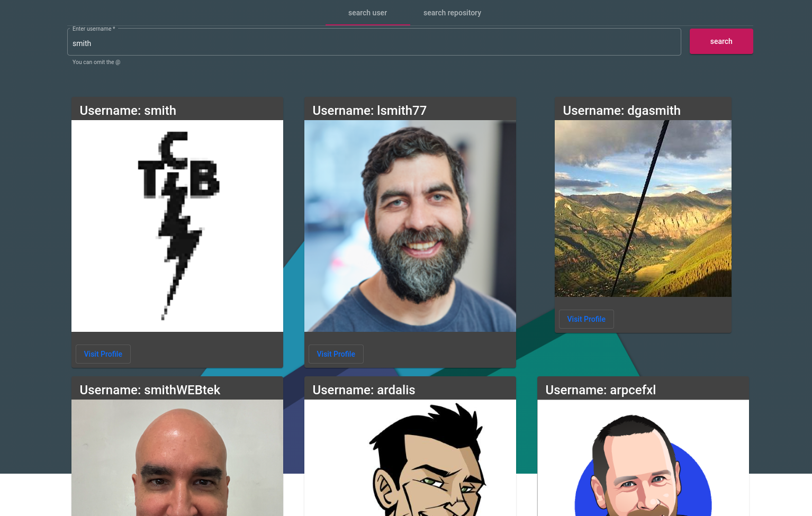
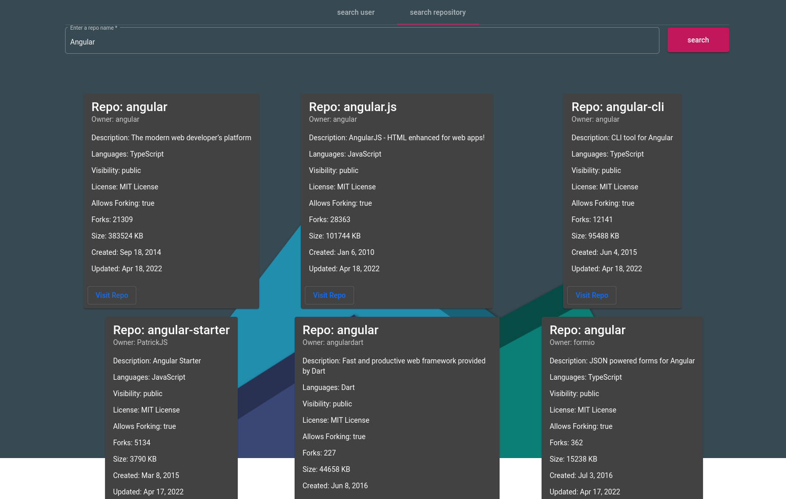

# GithubSearch

This project was generated with [Angular CLI](https://github.com/angular/angular-cli) version 13.2.6.

# GithubSearch



### By: Edwin Karimi

## Table of Content

- [Description](#description)
- [Installation Requirement](#usage)
- [Technology Used](#technologies)
- [Licence](#licence)
- [Authors Info](#author-info)

## Description

This is a GitHub search website made in Angular 13, Material Angular, Bootstrap 5 and the Github API. You can for a github user using their username or s repository using the repo. For more details on the users, profile or the repos details, the website redirects you to GitHub.



## Behaviour Driven Development

The user is able to;

- Search for GitHub user

- Can't request an empty input

- Search for a repo

- Get repos details


### Requirements

- Either a computer, phone, tablet or an Ipad

- An access to the Internet

### 1. Local Repository

- Make sure you have a stable internet to have the ability to clone the repository.
- Type the following command in your terminal to clone this repository

```
git clone https://github.com/Edu58/Angular-Github-Search.git
```

If you are using SSH, use the following command

```
git clone https://github.com/Edu58/Angular-Github-Search.git
```

When you run the commands successfully, you should have a local version of this repository.

- Before running the application, make sure you have angular CLI, nodejs (best choice LTS), and nmp installed on your machine

- use the command below to start the application and lauch it in your browser

```
ng serve --open
```

### 2. Online Repository

- Make sure you have a stable internet for forking this repository.
- According to the license, you can fork this project. You need to click on the forking icon and it will be added as one of your repositories

Feel free to fork the project and have fun with it. Happy coding!

## Technologies

- HTML5
- CSS3
- Angular
- Typescript
- Material Angular
- Bootstrap


This project was generated with [Angular CLI](https://github.com/angular/angular-cli) version 13.2.6.

## Development server

Run `ng serve` for a dev server. Navigate to `http://localhost:4200/`. The app will automatically reload if you change any of the source files.


## Licence

Copyright (c) Edwin Karimi 2022 - [MIT Licence](LICENSE)

## Author Info

- Twitter - [@GISDevEd](https://twitter.com/GISDevEd)
- Linkedin - [edwin-karimi](https://www.linkedin.com/in/edwin-karimi/)

To get more help on the Angular CLI use `ng help` or go check out the [Angular CLI Overview and Command Reference](https://angular.io/cli) page.


## Further help

To get more help on the Angular CLI use `ng help` or go check out the [Angular CLI Overview and Command Reference](https://angular.io/cli) page.
